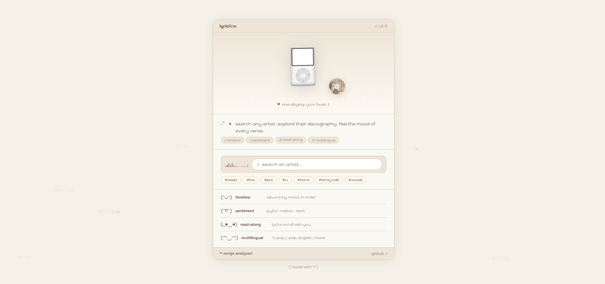
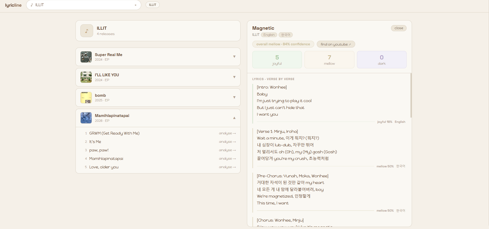

# lyricline

explore any artist's full discography as a visual timeline with multilingual lyric sentiment analysis. built for k-pop, j-pop, english, and mixed-language artists.




> search an artist → browse albums on a timeline → click a song → see lyrics analyzed verse by verse with mood scoring

---

## features

- **discography timeline** — every album and EP in chronological order, colored by dominant mood
- **per-verse sentiment** — each verse scored as joyful / mellow / dark with a confidence percentage
- **multilingual** — korean, japanese, english, and mixed-language lyrics all work natively via unicode range detection
- **artist thumbnails** — search results enriched with artist images from the Genius API
- **find on youtube** — one-click link per song
- **in-memory caching** — repeat visits are instant; sentiment results cached for the session

---

## stack

| layer | tech |
|---|---|
| server | Node.js · Express · TypeScript |
| sentiment | `@huggingface/transformers` (DistilBERT multilingual) — runs fully locally |
| lyrics | Genius API search + Cheerio scrape |
| discography | MusicBrainz API (free, no key needed) |
| cover art | Cover Art Archive |
| cache | in-memory Map |
| client | React · Vite · TypeScript · SWR |

---

## how it works

**sentiment pipeline** — lyrics are chunked into verse blocks, each chunk is run through `lxyuan/distilbert-base-multilingual-cased-sentiments-student`, a multilingual DistilBERT model trained across 12 languages. language detection uses unicode range analysis (more accurate than `franc` for short mixed-language k-pop text). a calibration layer adjusts scores for lyric context since the model was trained on social media text.

**data flow**
```
user searches artist
  → MusicBrainz API: artist MBID + release groups
  → for each release group: fetch tracklist + cover art (parallel, rate-limited)
  → user clicks song
  → Genius API: search for lyric page URL
  → Cheerio: scrape lyrics from page
  → DistilBERT: score each verse locally
  → render sentiment breakdown
```

---

## setup

### prerequisites
- Node.js 20+
- free [Genius API token](https://genius.com/api-clients) — client access token only, no OAuth needed

### model setup (one time)

the sentiment model runs locally via ONNX. download the files into `server/model-cache/lxyuan/distilbert-base-multilingual-cased-sentiments-student/`:

```powershell
# PowerShell
$token = "hf_your_token_here"
$headers = @{ Authorization = "Bearer $token" }
$base = "https://huggingface.co/lxyuan/distilbert-base-multilingual-cased-sentiments-student/resolve/main"
$out = "server\model-cache\lxyuan\distilbert-base-multilingual-cased-sentiments-student"

New-Item -ItemType Directory -Force -Path "$out\onnx"

Invoke-WebRequest -Uri "$base/config.json"             -OutFile "$out\config.json"             -Headers $headers
Invoke-WebRequest -Uri "$base/tokenizer.json"          -OutFile "$out\tokenizer.json"          -Headers $headers
Invoke-WebRequest -Uri "$base/tokenizer_config.json"   -OutFile "$out\tokenizer_config.json"   -Headers $headers
Invoke-WebRequest -Uri "$base/vocab.txt"               -OutFile "$out\vocab.txt"               -Headers $headers
Invoke-WebRequest -Uri "$base/special_tokens_map.json" -OutFile "$out\special_tokens_map.json" -Headers $headers
Invoke-WebRequest -Uri "$base/onnx/config.json"        -OutFile "$out\onnx\config.json"        -Headers $headers
Invoke-WebRequest -Uri "$base/onnx/model.onnx"         -OutFile "$out\onnx\model.onnx"         -Headers $headers
```

the last file is ~541MB and takes a few minutes.

### install and run

```bash
git clone https://github.com/chewytapioca/lyricline
cd lyricline

cp .env.example .env
# add your GENIUS_TOKEN to .env

cd server && npm install
cd ../client && npm install
```

```bash
# terminal 1 — server (port 3001)
cd server && npm run dev

# terminal 2 — client (port 5173)
cd client && npm run dev
```

open [http://localhost:5173](http://localhost:5173)

first sentiment analysis per song takes ~5–10 seconds (model loads once then stays warm). results are cached in memory so repeat clicks are instant.

---

## project structure

```
lyricline/
  shared/
    types.ts                    ← shared TypeScript types (server + client)
  server/src/
    index.ts                    ← Express entry
    routes/
      search.ts                 ← GET /api/search?q=
      artist.ts                 ← GET /api/artist/:mbid
      song.ts                   ← GET /api/song/:mbid?title=&artist=
    services/
      musicbrainz.ts            ← discography + cover art, rate-limited queue
      genius.ts                 ← lyric URL search + Cheerio scrape
      sentiment.ts              ← local ONNX sentiment pipeline
    cache/
      redis.ts                  ← in-memory Map cache (drop-in Redis compatible)
  client/src/
    App.tsx                     ← root layout + state
    LandingPage.tsx             ← landing with search
    components/
      SearchBar.tsx             ← debounced search with artist thumbnails
      Timeline.tsx              ← album timeline with mood colors
      SongDetail.tsx            ← lyric viewer with per-verse sentiment
    hooks/
      useArtist.ts              ← SWR artist data hook
      useSong.ts                ← lazy sentiment loader
    lib/
      api.ts                    ← typed fetch wrapper
```

---

## notes

- MusicBrainz enforces a 1 req/s rate limit — the server uses a promise queue to batch album fetches without violating it
- the sentiment model is gitignored (~541MB) and must be downloaded separately
- `.env` is gitignored — never committed